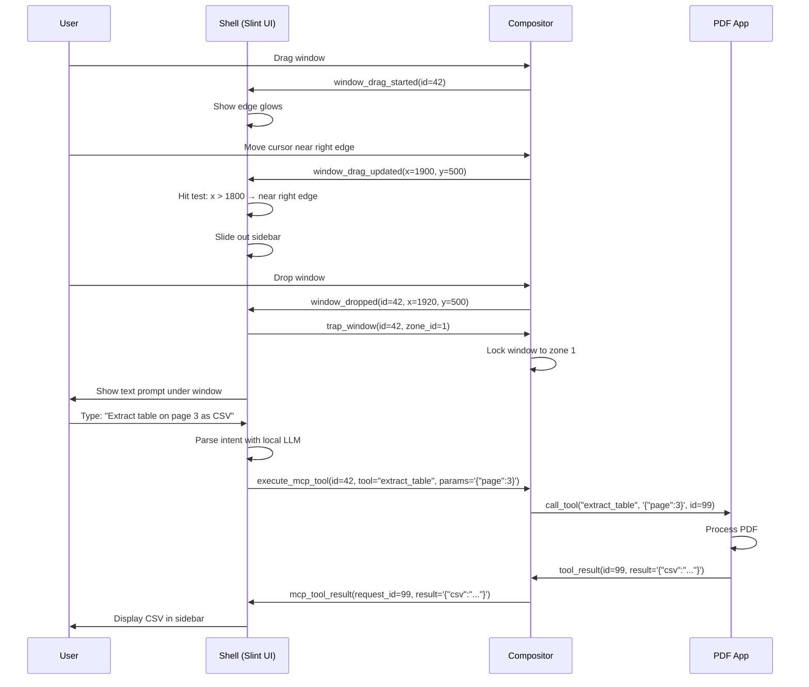

# Nanaimo "Auto" Area: AI-Assisted Compositor Design Paper

## 1. User Experience (UX)

The "Auto" area transforms window management into an AI-assisted workflow. Instead of manually controlling windows, users can drag them to screen edges and give natural language instructions.

### 1.1 The Multi-Edge Auto Sidebar

**Discovery & Activation**:
- When the user starts dragging any window, subtle **glows appear on the left and right edges** of each monitor (not top/bottom).
- These glows indicate: "Bring your window here to activate Auto mode."

**Interaction**:
- As the cursor approaches a glowing edge, the **Auto Sidebar slides out** from that edge.
- The sidebar shows:
  - Any windows already in Auto mode on that edge (scrollable list)
  - A drop zone for the currently dragged window
- When the user **drops** the window, it snaps into the sidebar and a **text prompt appears underneath it**.

**The Command Loop**:
1. User types a natural language instruction (e.g., "Extract the table on page 3 as CSV")
2. The shell checks if the window supports MCP:
   - **If yes**: Full automation via the app's MCP tools
   - **If no**: Basic compositor actions (screenshot, move to workspace, etc.)
3. A mini-log shows reasoning progress below the prompt
4. Results appear in the sidebar or as notifications

**Multi-Monitor & Multi-Edge**:
- Each monitor's left and right edges can have independent Auto sidebars
- Edges that border another monitor do **not** show glows (to avoid confusion)
- Keyboard shortcut (e.g., `Super+A`) can send the focused window to the nearest Auto edge

### 1.2 Development Experience & Fast Iteration

The UI follows a **Process-Decoupled Shell** architecture:
- **UI Library**: [Slint](https://slint.dev/) for declarative, CSS-like UI design
- **Live Preview**: Developers iterate on `.slint` files in real-time without recompiling the compositor
- **Hot Reloading**: The shell is a separate Wayland client. Kill and restart it in milliseconds while the compositor keeps running
- **Mocking**: The shell can run in "mock mode" on any Wayland/X11 desktop for UI-only development

---

## 2. Protocol Architecture

Nanaimo uses **two protocols** to enable this:
1. **`ext-nanaimo-shell-v1`**: General-purpose shell state streaming (compositor ↔ shell)
2. **`ext-mcp-v1`**: MCP communication (compositor ↔ apps)

### 2.1 The "Shell as Brain, Compositor as Muscle" Architecture

**Design Philosophy**: The compositor should be **dumb about UI** and **smart about geometry**. The shell should be **smart about UI** and just **react to geometry events**.

| Component | Responsibilities |
| :--- | :--- |
| **Compositor** | Track window positions, handle input, enforce window locks, forward MCP messages |
| **Shell** | Define zones, detect zone entry, render UI, orchestrate MCP sessions, handle animations |

This separation means:
- Adding new shell features (dock, workspace switcher) requires **zero compositor changes**
- UI iteration happens in Slint (fast) instead of Rust compositor code (slow)
- The compositor remains simple and stable

---

## 3. Protocol Specifications

### 3.1 ext-nanaimo-shell-v1: Shell State Streaming

This protocol streams **all window management state** from the compositor to the shell.

```xml
<protocol name="ext_nanaimo_shell_v1">
  <interface name="ext_nanaimo_shell_manager_v1" version="1">
    <request name="get_shell">
      <arg name="id" type="new_id" interface="ext_nanaimo_shell_v1"/>
    </request>
  </interface>

  <interface name="ext_nanaimo_shell_v1" version="1">
    <!-- Compositor → Shell: Window Lifecycle -->
    <event name="window_created">
      <arg name="window_id" type="uint"/>
      <arg name="app_id" type="string"/>
      <arg name="title" type="string"/>
    </event>
    
    <event name="window_destroyed">
      <arg name="window_id" type="uint"/>
    </event>
    
    <!-- Compositor → Shell: Drag Events -->
    <event name="window_drag_started">
      <arg name="window_id" type="uint"/>
      <arg name="output" type="object" interface="wl_output"/>
    </event>
    
    <event name="window_drag_updated">
      <arg name="window_id" type="uint"/>
      <arg name="pointer_x" type="int"/>
      <arg name="pointer_y" type="int"/>
    </event>
    
    <event name="window_dropped">
      <arg name="window_id" type="uint"/>
      <arg name="final_x" type="int"/>
      <arg name="final_y" type="int"/>
    </event>
    
    <!-- Compositor → Shell: MCP Capabilities -->
    <event name="window_mcp_capabilities">
      <arg name="window_id" type="uint"/>
      <arg name="has_mcp" type="uint"/> <!-- boolean -->
      <arg name="tool_count" type="uint"/>
      <arg name="tools_json" type="string"/> <!-- JSON array of tool names -->
    </event>
    
    <!-- Shell → Compositor: Zone Management -->
    <request name="define_zone">
      <arg name="zone_id" type="uint"/>
      <arg name="output" type="object" interface="wl_output"/>
      <arg name="edge" type="uint"/> <!-- enum: 0=left, 1=right -->
      <arg name="width_pixels" type="int"/>
    </request>
    
    <request name="destroy_zone">
      <arg name="zone_id" type="uint"/>
    </request>
    
    <!-- Shell → Compositor: Window Control -->
    <request name="trap_window">
      <arg name="window_id" type="uint"/>
      <arg name="zone_id" type="uint"/>
    </request>
    
    <request name="release_window">
      <arg name="window_id" type="uint"/>
    </request>
    
    <!-- Shell → Compositor: MCP Orchestration -->
    <request name="execute_mcp_tool">
      <arg name="window_id" type="uint"/>
      <arg name="tool_name" type="string"/>
      <arg name="params_json" type="string"/>
      <arg name="request_id" type="uint"/>
    </request>
    
    <!-- Compositor → Shell: MCP Results -->
    <event name="mcp_tool_result">
      <arg name="request_id" type="uint"/>
      <arg name="success" type="uint"/> <!-- boolean -->
      <arg name="result_json" type="string"/>
    </event>
    
    <event name="mcp_tool_progress">
      <arg name="request_id" type="uint"/>
      <arg name="status_text" type="string"/>
    </event>
  </interface>
</protocol>
```

### 3.2 ext-mcp-v1: App Communication

This protocol allows apps to expose themselves as MCP servers. The compositor acts as the MCP Host.

```xml
<protocol name="ext_mcp_v1">
  <interface name="ext_mcp_manager_v1" version="1">
    <request name="get_session">
      <arg name="id" type="new_id" interface="ext_mcp_session_v1"/>
      <arg name="surface" type="object" interface="wl_surface"/>
    </request>
  </interface>

  <interface name="ext_mcp_session_v1" version="1">
    <!-- Compositor → App: Tool Invocation -->
    <event name="call_tool">
      <arg name="method" type="string"/>
      <arg name="params" type="string"/> <!-- JSON blob -->
      <arg name="id" type="uint"/>
    </event>
    
    <!-- App → Compositor: Tool Response -->
    <request name="tool_result">
      <arg name="id" type="uint"/>
      <arg name="result" type="string"/> <!-- JSON result -->
      <arg name="error" type="string" allow-null="true"/>
    </request>
    
    <!-- App → Compositor: Capability Advertisement -->
    <request name="advertise_tools">
      <arg name="tools_json" type="string"/> <!-- JSON array -->
    </request>
  </interface>
</protocol>
```

---

## 4. Interaction Flow Example

### Scenario: User asks a PDF reader to extract a table



---

## 5. Integration with Nanaimo Architecture

### 5.1 Compositor Changes (`state.rs`)
- Add `ShellStateManager` to `NanaimoState` to track shell protocol connections
- Add `McpManager` to route MCP messages between shell and apps
- Modify `PointerMoveSurfaceGrab` to emit `window_drag_updated` events
- Add window locking logic for trapped windows

### 5.2 Shell Implementation (`nanaimo-shell`)
- Slint UI with `.slint` files for sidebar, prompts, and animations
- Rust glue code to:
  - Listen to `ext-nanaimo-shell-v1` events
  - Perform hit-testing for zone detection
  - Send `trap_window` and `execute_mcp_tool` requests
  - Integrate with a local LLM (e.g., via Ollama or OpenAI API)

### 5.3 Layer Shell Integration
The shell uses `wlr-layer-shell` to anchor sidebars to screen edges:
- Each sidebar is a separate `layer_surface` with `anchor = LEFT | TOP | BOTTOM` or `RIGHT | TOP | BOTTOM`
- The compositor handles z-ordering and input focus automatically

---

## 6. MCP Capability Indicators

Windows that support `ext-mcp-v1` will be visually distinguished:

- **In the sidebar**: A small sparkle icon (✨) appears on the window's thumbnail
- **On hover**: A tooltip shows: "Supports 12 automation tools"
- **In the prompt**: The shell can suggest available tools as autocomplete options

This helps users understand which windows have advanced capabilities vs. basic compositor-level actions.

---

## 7. Fallback for Non-MCP Apps

When a window doesn't support MCP, the shell offers **basic compositor actions**:

- "Take a screenshot of this window"
- "Move to workspace [1-9]"
- "Resize to half screen"
- "Close this window"
- "Show window info" (app_id, PID, executable path)

These are implemented entirely in the compositor and don't require app cooperation.
